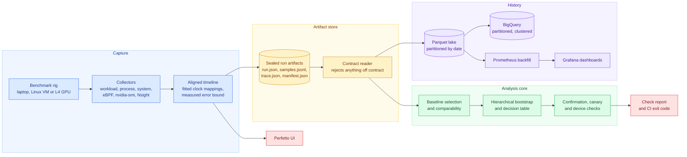
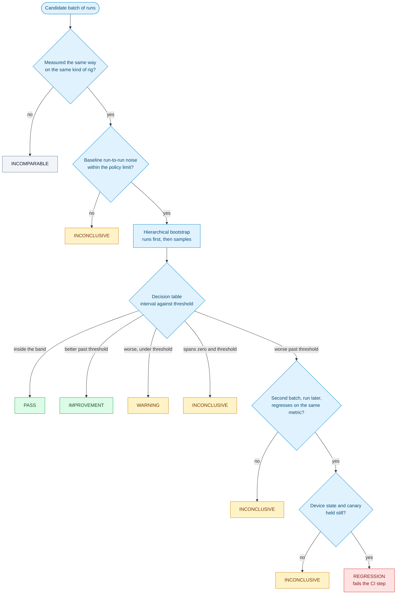
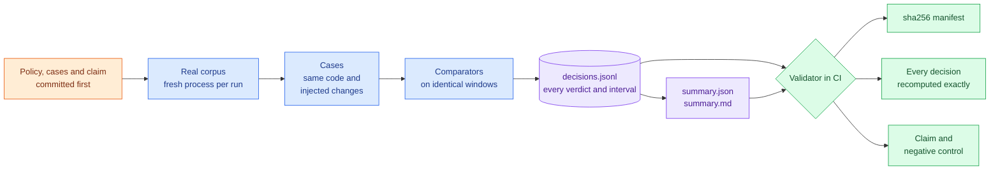
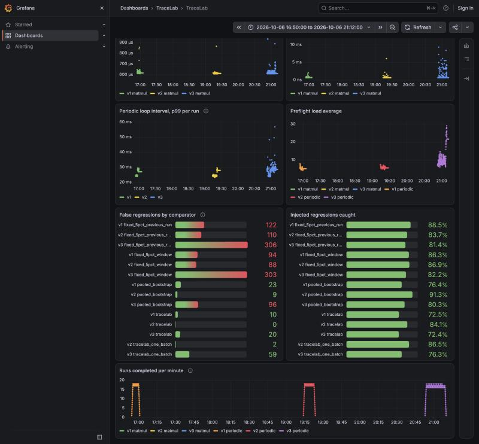

# tracelab

Performance tracing and regression analysis for benchgrid's run artifacts.
TraceLab records a benchmark with several collectors on one aligned timeline,
eBPF scheduler tracing and CUDA kernels included, decides whether a candidate
revision regressed with a statistical engine built not to cry wolf, and keeps
history in BigQuery behind Grafana dashboards.

The engine is the part the evidence is about. Seven evaluations over 2,042 real
benchmark runs, three of them on NVIDIA L4 GPUs, test it against the gates
teams usually write, with every decision published and recomputed in CI.

> On real benchmark runs, TraceLab returns REGRESSION only when two batches of
> a candidate, run apart, both move past a metric's practical threshold by more
> than the run-to-run noise the baseline itself shows, and the environment did
> not move with them. On a quiet machine that held false regressions at zero.
> Under real contention it removed most of them, not all: what is left, in
> every evaluation that failed, comes from changes in the machine the checks
> could not see.

A performance gate that fires on noise gets muted within a month, and a muted
gate is worse than none because people still believe it is watching. So most of
the evidence here is about the other side of the promise: what happens when the
code did not change and the machine was simply noisy.

## Results at a glance

Each version's thresholds, cases and claim were committed before its corpus
was collected, which the history shows. Six of the seven claims failed. Each
failure is traced to its cause in [docs/evidence.md](docs/evidence.md) and
pinned by the validator at its exact count, so it can neither be edited away
nor drift.

| version | what it tested | TraceLab false regressions | fixed 5% gates | outcome |
| --- | --- | ---: | ---: | --- |
| v1 | latency and jitter, one batch | 10 | 94 and 122 | failed, pinned at 10 |
| v2 | confirmation by a second batch, quiet laptop | **0** | 88 and 110 | **held** |
| v3 | scheduled CPU bursts against confirmation | 3 on targeted windows, 20 overall | over 300 | failed, pinned at 3 |
| v4 | rates where higher is better, traces sealed | 11 | 141 and 208 | failed, pinned at 11 |
| v5 | CUDA matmul on an L4 | 3, none on same code | 0 and 6 | failed, pinned at 3 |
| v6 | a canary benchmark against long CPU bursts | 9 targeted, against 29 without it | over 250 | failed, pinned at 9 |
| v7 | a GPU clock check against a warming L4 | 2, against 4 without it | 0 and 6 | failed, pinned at 2 |

Other comparators score every case alongside TraceLab: the same engine with
each defence removed, a bootstrap that pools samples as if independent, and
fixed 5% gates against a twenty-run window and against the previous run.
Their false regressions are the reason TraceLab's mean anything, and the
validator fails the build if the weaker comparators stop producing them.

## Architecture



- **Capture.** `tracelab record` runs a benchmark with every collector
  attached. Each collector stamps samples on its own clock; the timeline fits
  the mapping between clocks from readings taken through the run and records
  how far any two events on different tracks can be trusted to be apart.
- **Artifact store.** Runs are sealed in benchgrid's run artifact contract,
  with traces and alignment reports as extra files listed in the manifest. The
  contract reader validates every byte before anything else sees a run.
- **Analysis core.** Pure Python on numpy and pydantic, with a script in CI
  that fails the build if it imports anything else, so every verdict can be
  tested without a database or a web framework in the way.
- **History.** The lake feeds BigQuery for cross-corpus rollups and a
  Prometheus backfill for Grafana, each checked against the lake rather than
  trusted.

## How a verdict is reached



**Runs before samples.** Samples inside one process share a frequency state, a
cache layout and a scheduler, so they are not independent observations of the
code. The bootstrap resamples runs first and samples within them second.
Pooling them instead gives an interval that ignores the run-to-run drift that
dominates on real hardware; the pooled bootstrap comparator is that mistake.

**Six verdicts, not two.** With the change signed so positive is worse, a 95%
interval and a practical threshold per metric:

| interval and point estimate | verdict |
| --- | --- |
| entirely inside plus or minus the threshold | PASS |
| above zero, point estimate at or past the threshold | REGRESSION |
| above zero, point estimate below the threshold | WARNING |
| below zero, point estimate at or past minus the threshold | IMPROVEMENT |
| spans zero and reaches past the threshold | INCONCLUSIVE |

Only REGRESSION fails a CI step. INCONCLUSIVE and INCOMPARABLE are neutral,
because a gate that blocks on its own uncertainty is the gate that gets
disabled.

**What makes two runs comparable** is TraceLab's own definition, because
benchgrid's spec hash covers the revision and can never match across commits:
the spec without its `revision` and `artifacts` keys, plus hardware class,
architecture and whether the rig is emulated
([ADR 0001](docs/adr/0001-comparison-key.md)).

**Confirmation** asks a second batch, run about a minute later, to regress on
the same metric before anything blocks
([ADR 0002](docs/adr/0002-confirmation-batches.md)). **Environment checks**
then refuse a regression measured while a canary benchmark also regressed, or
while the device's own state, such as a GPU clock, differed from the baseline
([ADR 0003](docs/adr/0003-environment-aware-verdicts.md)).

## Evaluation and evidence



Every run in a corpus is the same code, so an untouched window is a same-code
comparison whose correct answer is known without trusting anything. Injected
cases transform the candidate's real samples by a stated amount: uniform
slowdowns of 2 to 20%, tail-only inflation, wider spread, displaced ticks, a
guardrail increase, a noisy baseline. Nothing about the noise is generated;
only the change is.

**v2, a quiet laptop.** Zero false regressions across 613 cases and 72
same-code windows, against 88 and 110 for the fixed gates, while catching 212
of 252 injected regressions. v1, the same engine without confirmation, had
raised ten, five of them on same code while the test suite loaded the machine.

**v3, scheduled contention.** One busy loop per core started at fixed run
indexes. On the nine windows where only the first batch was contended,
confirmation cut false regressions from 31 to 3. The three left came from an
unscheduled shift in the machine that outlasted the gap between batches.

**v4, rates.** Memory bandwidth and loopback network throughput, where higher
is better. Eleven false regressions, all from a two-minute disturbed stretch in
which both unrelated benchmarks collapsed at the same indexes.

**v5 and v7, real GPUs.** CUDA matmul on two L4s, the device reporting its own
clock and temperature. Both GPUs warmed under load and their clocks fell, 4.5%
on the first and 6.5% on the second, and throughput fell with them. v7's clock
check refused the warm-up windows and cut false regressions from 4 to 2; the
two left drifted inside its limit.

**v6, the canary.** Memory bandwidth and network as each other's canary under
long CPU bursts covering both batches. The canary cut false regressions there
from 29 to 9; every survivor was a network candidate whose memory-bound canary
did not feel the contention that halved network throughput.

**The cost of caution is published too.** In v6 TraceLab caught 78 of 496
injected regressions with its checks and 210 without; the fixed gates caught
about 400 by raising over 250 false ones.

## Tracing: why a metric moved

| collector | measures | clock |
| --- | --- | --- |
| workload | every iteration as a slice, every metric as a point | monotonic, in the workload |
| process | CPU user and system time, RSS, context switches, every 10 ms | monotonic, in the recorder |
| system | machine-wide and busiest-core CPU utilisation | wall clock, out of process |
| eBPF | run-queue waits and preemptions of the workload thread | CLOCK_MONOTONIC in the kernel |
| nvidia-smi | GPU utilisation, memory, power, temperature, SM clock | wall clock |
| Nsight Systems | every CUDA kernel and memory copy | nsys session clock |

- **Alignment.** Each clock-to-clock reading is a sandwich of the reference
  clock around the other, and a line fitted through readings taken across the
  run models drift. Across 30 traced runs the wall-to-monotonic error bound
  has a median of 0.36 microseconds and a maximum of 0.63.
- **eBPF.** In a Linux container, twelve busy loops on ten CPUs took a 20 ms
  loop from 0 to 90 late ticks out of 150, and its p99 run-queue wait from
  0.8 ms to 11.9 ms, with the late ticks the ones that waited.
- **GPU.** On an L4, all 50 measured iterations contain exactly the 10 GEMM
  kernels they launched, accounting for 99.6% of each iteration's CUDA-event
  time, though the two sources share no clock. Nsight Compute puts the cuBLAS
  GEMM at 16.3% achieved occupancy, held to two blocks per SM by 234 registers
  per thread, while it runs near 50 TFLOP/s.

Details, and the collector bugs the recordings found, are in
[docs/collectors.md](docs/collectors.md).

## History: warehouse and dashboards

`tracelab warehouse` flattens every corpus into a date-partitioned Parquet
lake, loads it into BigQuery tables partitioned on run start and clustered on
benchmark, hardware class and metric, runs rollups in BigQuery's dialect, and
recomputes every rollup from the lake, failing on any difference. In a GCP
project 1,346 runs and 293,810 samples load in about 21 seconds and every
rollup agrees with the lake to 1e-9. The same check on the BigQuery emulator
caught it returning `APPROX_QUANTILES` input unsorted, which BigQuery itself
does not ([docs/warehouse.md](docs/warehouse.md)).

`script/dashboards.sh` backfills Prometheus from the lake so every run sits at
the moment it ran, behind a provisioned Grafana dashboard.



## Quickstart

Requires Python 3.12, [uv](https://docs.astral.sh/uv/), and Docker for the
dashboards and eBPF recordings.

```
uv sync --all-groups
uv run pytest
uv run python -m script.validate_evidence
```

Compare a candidate revision against its baseline and print the check:

```
uv run tracelab compare <store> --policy policies/v2/matmul.toml \
    --candidate <revision> --known-good revisions.txt
```

Record a benchmark onto one aligned timeline, with eBPF in Linux or CUDA
kernels on a GPU:

```
uv run tracelab record --out trace.json -- python -m evaluation.workload periodic
script/ebpf_record.sh periodic trace.json
uv run tracelab record --gpu --nsys "$(which nsys)" --out trace.json -- python3 -m evaluation.workload gpu
```

Load history and bring up the dashboards:

```
uv run tracelab warehouse export --lake lake --store v2=corpus/v2/store
uv run tracelab warehouse bigquery --lake lake --project <gcp-project>
script/dashboards.sh
```

`revisions.txt` is the known-good set, for example the output of
`git rev-list main`. The report names the metric that decided, its interval,
the baseline and what was left out of it and why, and links any trace sealed
with the candidate runs.

## Repository layout

| path | what |
| --- | --- |
| `src/tracelab/core` | contract reader, statistics, decision rule, comparability, baseline selection, confirmation and environment checks |
| `src/tracelab/ingest` | reads an artifact store, highest sealed attempt only |
| `src/tracelab/collect` | collectors, clock alignment, Perfetto export, eBPF, NVIDIA |
| `src/tracelab/warehouse` | Parquet lake, BigQuery tables and rollups, the rollup check, OpenMetrics |
| `src/tracelab/cli.py`, `report.py` | the commands and the check they print |
| `evaluation/` | workloads, corpus collector, contention schedules, cases, comparators, scorer, attribution and occupancy analyses |
| `corpus/`, `policies/`, `evidence/` | each published version, frozen, with the eBPF and GPU traces and what BigQuery returned |
| `deploy/` | Prometheus and Grafana, and the Linux image for eBPF recordings |
| `script/` | the evidence validator, the layering check and the prose check |

## Known limits

- A change in the machine that lasts across both batches, and that neither a
  canary nor a device metric reflects, still reads as a regression.
- The environment checks refuse real regressions measured while the machine
  moved; that cost is large and published.
- Every corpus comes from a laptop or two L4 VMs over a few days. Injected
  changes are transforms of real samples, not real code changes.

The full list is written for someone trying to break it, in
[docs/known-misses.md](docs/known-misses.md).

## Documents

- [PLAN.md](PLAN.md), with what changed from it and why
- [docs/evidence.md](docs/evidence.md): how each corpus was collected, every failure traced, and how to check it
- [docs/collectors.md](docs/collectors.md): collectors, clock alignment, eBPF and GPU results
- [docs/warehouse.md](docs/warehouse.md): the lake, BigQuery rollups and dashboards
- [docs/known-misses.md](docs/known-misses.md): what this does not catch
- [docs/non-goals.md](docs/non-goals.md): what is deliberately absent
- [docs/adr](docs/adr): the decisions, with their reasons
